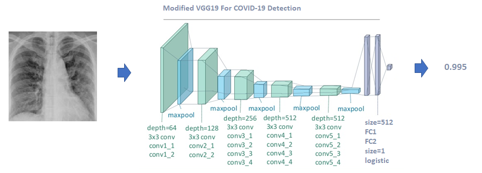

# PredictionModel

## Introduction
We propose a deep neural network for the purpose of detecting COVID-19 from chest
X-ray (CXR) images. Since this pandemic has emerged worldwide in less than a year, there is no
large dataset available for it. So for its detection, care must be taken not to use methods with high
variance. However, for a deep neural network to get acceptable performance, we usually need huge
amounts of datasets. Otherwise, there may be issues like overfitting. To solve this problem, we
use the beautiful idea of transfer learning. Training a deep neural network with the idea of transfer
learning on 2 available datasets on the web, we achieved a COVID-19 detection accuracy of 98% on
about 1000 test samples. A web application is available on [mhcovid.com](http://www.mhcovid.com)

## How It's Working
For the implementation, we use a pre-trained VGG-19 network. We keep its convolutional layers and discard the rest.
We simply add 2 fully-connected layers to them. We do the training just on the fully-connected layers and not on the
convolutional layers since they have been trained earlier and are good at their job. Of course, training the last layers of
the convolutional layers can even cause more improvement in the performance, but without training them further, we
have achieved acceptable performance. So we did not train them. Below is an image of the neural network.


## How To Use
### Website
As mentioned in the introduction, you can do the prediction job using our [MHCOVID website](http://www.mhcovid.com)

### Code
In the code level, for the sake of simple usage, everything is done using MHCovid class. As simple as the below code:

```python
from MHCovid import MHCovid

mh = MHCovid()
model = mh.generateModel()
print(mh.predict(model, 'covid1.jpg'))
```
